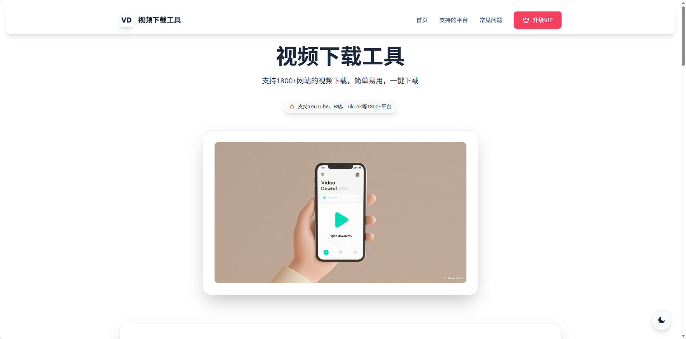
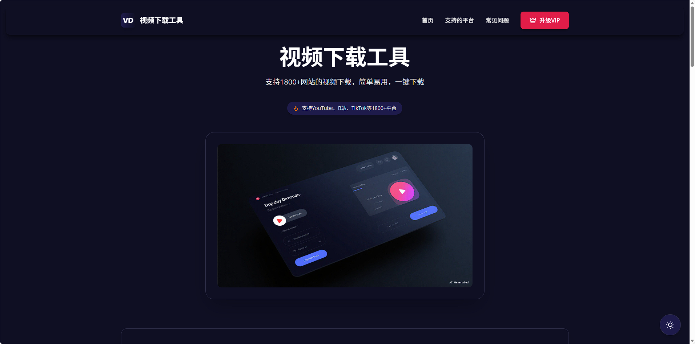
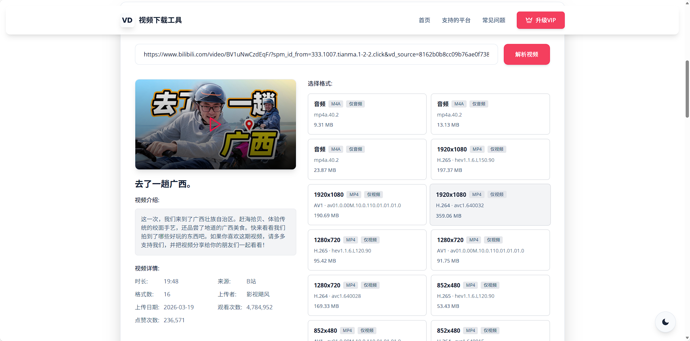
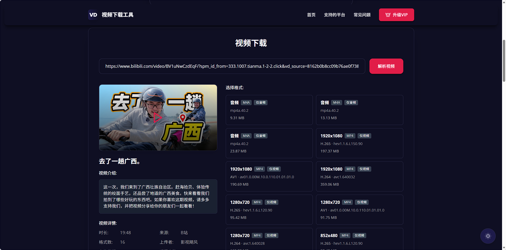
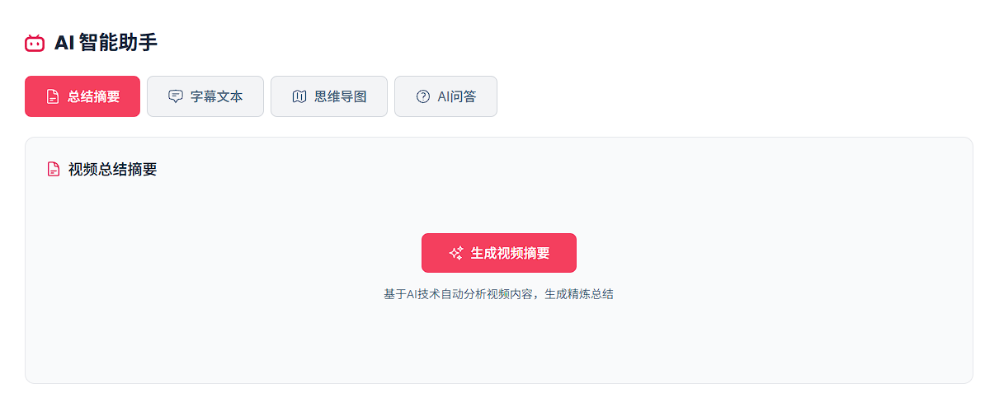

# 视频下载工具

一个现代化的视频下载工具，支持多平台视频解析、AI智能分析和下载。采用前后端分离架构，支持抖音、B站、YouTube等1800+网站。

## 界面预览

### 首页
| 亮色模式 | 暗色模式 |
|---------|---------|
|  |  |

### 视频解析
| 亮色模式 | 暗色模式 |
|---------|---------|
|  |  |

### AI 智能助手


## 功能特性

### 核心功能
- 🚀 支持 1800+ 网站视频解析和下载
- 📱 抖音专用解析，无需 Cookie
- 🎬 B站视频双源解析（yt-dlp + injahow）
- 🎨 现代化 UI 设计，支持亮色/暗色主题
- 📹 视频预览播放
- 📊 多种清晰度选择，智能排序
- 📝 下载历史记录

### AI 智能助手（B站专属）
- 🤖 **AI 总结摘要** - 基于视频字幕自动生成内容摘要
- 📄 **字幕文本提取** - 支持 SRT/TXT 格式下载
- 🧠 **思维导图生成** - 可视化视频结构，支持全屏和 SVG 下载
- 💬 **AI 智能问答** - 基于视频内容回答用户问题

## 技术栈

### 前端
- **框架**: Vue 3 + Vite
- **样式**: Tailwind CSS + @tailwindcss/typography
- **HTTP客户端**: Axios
- **图标**: SVG图标（无emoji）
- **Markdown渲染**: marked
- **思维导图**: markmap-lib + markmap-view
- **主题**: 支持亮色/暗色模式切换，本地存储偏好

### 后端
- **框架**: FastAPI
- **视频解析**: yt-dlp + 自定义解析器
- **HTTP客户端**: httpx
- **B站专用**: injahow API + 并发解析优化
- **抖音专用**: 移动端页面解析
- **AI功能**: 支持 OpenAI 兼容接口（LongCat-Flash-Chat等）
- **缓存**: 内存缓存（5分钟TTL）

## 项目结构

```
video-download-tool/
├── backend/
│   ├── main.py              # FastAPI主入口
│   ├── douyin_parser.py     # 抖音专用解析器
│   ├── .env                 # 环境变量配置（AI API等）
│   └── requirements.txt     # Python依赖
├── frontend/
│   ├── src/
│   │   ├── App.vue          # 主组件
│   │   ├── components/      # Vue组件
│   │   │   └── MindmapViewer.vue  # 思维导图组件
│   │   ├── icons/           # SVG图标组件
│   │   └── utils/           # 工具函数
│   │       └── markmap.js   # markmap工具
│   ├── package.json
│   └── vite.config.js
├── docs/                    # 项目截图和文档
├── .gitignore
├── LICENSE                  # MIT协议
└── README.md                # 项目说明
```

## 快速开始

### 环境要求
- Python 3.8+
- Node.js 16+
- pnpm 或 npm

### 后端

```bash
cd backend

# 创建虚拟环境（推荐）
python -m venv venv
source venv/bin/activate  # Linux/Mac
# 或 venv\Scripts\activate  # Windows

# 安装依赖
pip install -r requirements.txt

# 配置环境变量（可选，用于AI功能）
cp .env.example .env
# 编辑 .env 文件，添加 AI_API_URL、AI_MODEL、AI_API_KEY

# 启动服务
python -m uvicorn main:app --host 0.0.0.0 --port 8000 --reload
```

### 前端

```bash
cd frontend

# 安装依赖
pnpm install
# 或 npm install

# 启动开发服务器
pnpm run dev
# 或 npm run dev
```

### 访问
- 前端: http://localhost:5173
- 后端 API: http://localhost:8000
- API 文档: http://localhost:8000/docs

## 使用说明

### 视频下载
1. 在输入框中粘贴视频链接（支持抖音、B站、YouTube等）
2. 点击"解析视频"
3. 选择想要的清晰度和格式
4. 点击"下载"按钮

### AI 智能助手（仅B站视频）
1. 解析B站视频后，如果视频有字幕，会自动显示 AI 助手区域
2. **总结摘要**: 点击生成，AI 会基于字幕生成内容摘要
3. **字幕文本**: 查看完整字幕，支持下载 SRT 或 TXT 格式
4. **思维导图**: 生成视频结构思维导图，支持全屏查看和 SVG 下载
5. **AI 问答**: 输入关于视频的问题，AI 基于字幕内容回答

## B站双源解析策略

### 解析源
1. **injahow API**: 返回音视频合并的MP4格式
2. **yt-dlp**: 返回DASH格式（音视频分离）

### 并发优化
- 两个解析源并发执行，取最快返回的结果
- 使用 `asyncio.gather` 实现并发

### 格式筛选与排序
- 纯音频（排在最前）
- 纯视频
- 音视频合并（排在最后）
  - injahow的源排在同类型最后

### 播放策略
- 默认选择格式列表最后一个（injahow的1080P）
- 使用injahow的播放源

## API 接口

### 视频解析
```
GET /api/parse?url={video_url}
```

### 获取直链
```
GET /api/get-direct-link?url={video_url}&format_id={format_id}
```

### 下载视频
```
GET /api/download?url={video_url}&format_id={format_id}
```

### 代理图片
```
GET /api/proxy-image?url={image_url}
```

### 代理视频
```
GET /api/proxy-video?url={video_url}
```

### AI 功能（B站）
```
# 获取字幕
POST /api/bilibili/subtitles
Body: { "url": "bilibili_video_url" }

# AI 总结
POST /api/bilibili/ai/summary
Body: { "url": "bilibili_video_url" }

# AI 思维导图
POST /api/bilibili/ai/mindmap
Body: { "url": "bilibili_video_url" }

# AI 问答
POST /api/bilibili/ai/qa
Body: { "url": "bilibili_video_url", "question": "用户问题" }
```

## 环境变量配置

在后端 `.env` 文件中配置：

```env
# AI大模型配置（OpenAI兼容接口）
AI_API_URL=https://api.example.com/v1/chat/completions
AI_MODEL=your-model-name
AI_API_KEY=your-api-key
```

## 技术亮点

1. **双源并发解析**: B站同时并发请求yt-dlp和injahow，提高解析速度和成功率
2. **智能排序**: 格式按类型和来源智能排序，优先推荐最佳格式
3. **代理优化**: 图片和视频通过后端代理，解决跨域问题
4. **完整主题适配**: 所有UI元素支持亮色/暗色主题，包括AI功能区域
5. **无Cookie解析**: 抖音和B站都无需用户提供Cookie
6. **AI功能集成**: 基于字幕的AI总结、思维导图和问答功能
7. **性能优化**: 解析结果5分钟缓存，减少重复请求

## 浏览器兼容性

- Chrome 90+
- Firefox 88+
- Safari 14+
- Edge 90+

## 许可证

MIT License

## 作者

TX

## 更新日志

### 2026-04-06
- 新增 AI 智能助手功能（总结、字幕、思维导图、问答）
- 优化 B站解析速度（并发双源解析）
- 添加解析结果缓存机制
- 新增字幕下载功能（SRT/TXT格式）
- 新增思维导图全屏和下载功能
- 优化 Markdown 渲染和排版

### 2026-04-03
- 初始版本发布
- 支持抖音、B站、YouTube等1800+网站
- 实现视频解析、播放、下载功能
- 支持亮色/暗色主题切换
